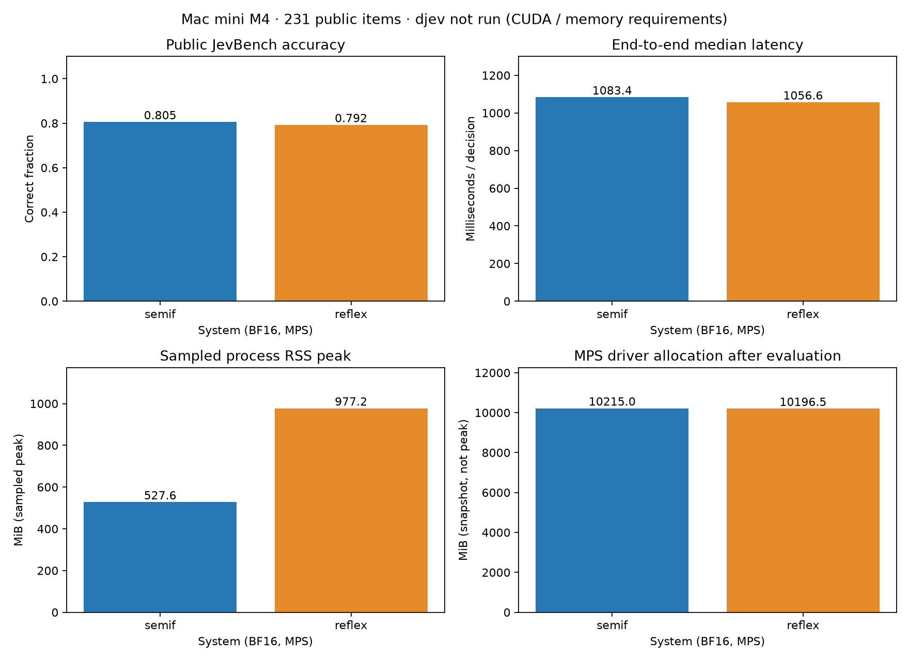
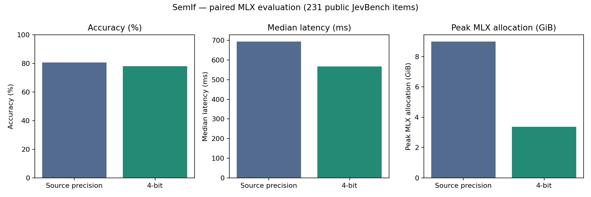
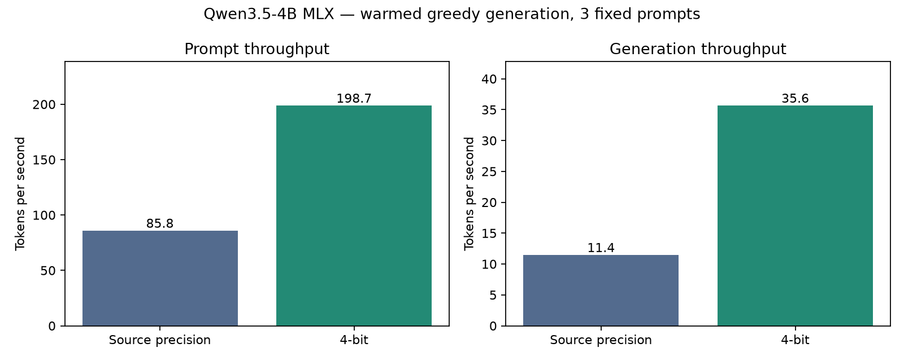

# SemIf Qwen3.5-4B — MLX 4-bit

GitHub overview for the **quantized MLX checkpoint**, converted and verified
on an Apple M4 Mac mini with 16 GiB unified memory on 2026-09-22.
This is a text-only decision model using SemIf's prompts and option-logit
readout over Qwen3.5-4B. No fine-tuning or adapter is added.

This single README serves GitHub and Hugging Face, and records Ollama
compatibility below.

## Published repositories

- [GitHub: code, executed notebooks and complete benchmark evidence](https://github.com/VinciGit00/semif-qwen3.5-4b-mlx-4bit)
- [Hugging Face: verified MLX 4-bit weights and the same reproduction package](https://huggingface.co/vinci00/semif-qwen3.5-4b-mlx-4bit)

After installing the dependencies below, download the published export instead
of converting again:

```bash
hf download vinci00/semif-qwen3.5-4b-mlx-4bit \
  --local-dir artifacts/semif-4b-mlx-4bit
python verify_decision_exports.py --system semif --export artifacts/semif-4b-mlx-4bit
```

The weights are the same checkpoint used for the measured results below.
Ollama 0.34.2 successfully imported the export preserving its source
quantization and passed the generation smoke test below. Registry upload is
in progress. MLX measurements are not Ollama measurements.

## Why this checkpoint?

SemIf is the provisional selection from the two converted 4B systems. Its
**source BF16 Torch/MPS configuration** scored 186/231 (80.52%) on public
JevBench, versus reflex's 183/231 (79.22%). This is a small descriptive lead:
the paired interval for SemIf minus reflex is approximately −3.46 to +6.06
percentage points. Public examples may overlap upstream development. djev
was not run on this machine.

**Those scores do not belong to this quantized artifact.** Both MLX 4-bit
exports passed 4/4 synthetic checks. Their full paired accuracy comparison
has not been performed, so the available evidence does not establish a best
quantized model. This folder packages the selected quantized candidate.

The [source benchmark report](data/source_benchmark_summary.json) and
[protocol](data/source_protocol.json) preserve the selection evidence.



## What has actually passed for MLX 4-bit?

| Check | Measured result |
| --- | --- |
| Weight format | MLX quantized Safetensors |
| Quantization | Affine 4-bit, group size 64; effective 4.503 bits/weight |
| Weight file size | 2,367,244,781 bytes (2.205 GiB) |
| Saved file checksums | Match conversion manifest |
| Save/reload probability difference | 0.0 on one synthetic request |
| Fixed functional requests | 4/4 passed: choice, yes, no, ordered score |
| Quantized JevBench accuracy | 180/231 (77.92%) |
| Paired MLX unquantized versus 4-bit accuracy | 80.52% → 77.92%; −2.60 percentage points |
| Ollama execution | Native MLX import and arithmetic generation smoke test passed on 0.34.2; decision accuracy not evaluated |

See the [raw quantized verification report](data/semif_export_verification.json)
for full probabilities, inputs, versions, hashes and timestamps. A successful
smoke check establishes basic functionality, not retained general accuracy.

## Run the quantized model

The checkpoint is stored on the Mac mini at
`/Users/marco/GitHub/LLM-crash-course/21-openjev/1-quantization/artifacts/semif-4b-mlx-4bit`.

```bash
ssh macmini
cd /Users/marco/GitHub/LLM-crash-course/21-openjev/1-quantization
.venv/bin/python verify_decision_exports.py \
  --system semif --export artifacts/semif-4b-mlx-4bit
```

This loads the quantized files, checks their hashes, prints four decisions,
and exits successfully only when all checks pass. For a new environment,
follow the pinned installation and inference instructions below.
The following sections contain the code and packaging instructions needed
to reproduce the checkpoint and its paired benchmark from this directory.

### Latest execution status

Conversion, persisted-model verification, both notebooks and the full paired
benchmark completed on the Mac mini on 2026-09-22. A fresh conversion through
the bundled CLI produced the same weight SHA-256 as the evaluated export and
matched reload probabilities on all four synthetic cases. All 231 decisions
completed for both variants.

| Measurement | MLX source precision | MLX 4-bit |
| --- | ---: | ---: |
| Correct / total | 186/231 | 180/231 |
| Accuracy | 80.52% | 77.92% |
| Median decision latency | 694.08 ms | 566.06 ms |
| Peak MLX allocation | 8.997 GiB | 3.370 GiB |
| Jev input throughput, end to end | 382.50 tokens/s | 384.80 tokens/s |
| Jev decision throughput | 0.548 decisions/s | 0.551 decisions/s |

The quantized-minus-baseline difference is **−2.60 percentage points**;
paired bootstrap 95% interval **[−6.93, +1.73] pp**. There are **15 regressions
and 9 improvements**. Public development data and the interval do not establish
general parity. Full-duration throughput and median latency summarize different
parts of this variable-length workload.



See the [paired summary](results/paired/summary.json),
[baseline predictions](results/paired/baseline.json), and
[quantized predictions](results/paired/quantized.json).

### Tokens per second: actual text generation

The Jev classifier returns option probabilities without generating answer
tokens. The separate generation benchmark uses three fixed short chat prompts,
128 generated tokens each, greedy sampling, thinking disabled and a warmup.

| Measurement | MLX source precision | MLX 4-bit |
| --- | ---: | ---: |
| Prompt processing | 85.78 tokens/s | 198.70 tokens/s |
| **Text generation** | **11.44 tokens/s** | **35.64 tokens/s** |
| Total generated tokens | 384 | 384 |

Rates use MLX-LM's separate prompt/generation timers and aggregate total tokens
over total time. They exclude model loading, chat formatting and warmup.
This is a short-prompt generation speed test, not a new quality measurement.
Input-token rates differ from Jev because the workloads and timing boundaries
are different. Keep these three measures distinct when comparing models.



See [raw token-speed results and protocol](results/tokens/).

## Install the reproduction code

Two notebooks explain the workflow:

- [01 — Create and use the quantized model](01_create_and_benchmark_semif_mlx.ipynb)
- [02 — Run and interpret the paired benchmark](02_benchmark_semif_mlx.ipynb)

Both call the same Python scripts. By default they read existing artifacts;
enable their execution switches and select fresh output directories to rerun
conversion or benchmarking. The first notebook also reloads the quantized
model and makes a new inference request.

Run on Apple Silicon from this directory:

```bash
python3.12 -m venv .venv
source .venv/bin/activate
python -m pip install -r requirements.txt
python -m pip install --no-deps \
  'git+https://github.com/TheoLeeCJ/SemIf.git@1f2dea3e25379f9dfc98cb83c324f00ab5deda37' \
  'git+https://github.com/fstandhartinger/jevbench.git@75e6224ed8103bbc3485ca74820a2eaf7ce8abe0'
python -m ipykernel install --prefix .venv --name semif-mlx --display-name 'Python (SemIf MLX)'
```

After creating the model and completing the benchmark, execute the notebooks:

```bash
python -m jupyter nbconvert --to notebook --execute --inplace \
  01_create_and_benchmark_semif_mlx.ipynb 02_benchmark_semif_mlx.ipynb \
  --ExecutePreprocessor.kernel_name=semif-mlx \
  --ExecutePreprocessor.timeout=1800
```

The bundled [runtime](decision_mlx.py) and [functional verifier](verify_decision_exports.py)
are snapshots of the conversion lesson, included so this directory can run
independently. The optional reflex branch in the shared runtime is not used
by this SemIf workflow. MLX-LM is pinned to commit
`a63e24c389382619eb6d9af656e3b46024be217a`; source Qwen3.5-4B to
`851bf6e806efd8d0a36b00ddf55e13ccb7b8cd0a`.

## Create the MLX 4-bit model

```bash
python create_model.py --output artifacts/semif-4b-mlx-4bit
python verify_decision_exports.py \
  --system semif --export artifacts/semif-4b-mlx-4bit
```

[create_model.py](create_model.py) downloads the pinned source as needed,
quantizes the text weights, saves the export and checks four fixed synthetic
requests before and after reload. It refuses to overwrite an existing output.
The export contains weights, configuration, tokenizer and a hashed manifest.
Source text parameters use BF16 and FP32; the vision tower is excluded.
No new training, fine-tuning or calibration fitting is performed.

An existing pinned Hugging Face snapshot may be passed with
`--source /path/to/pinned/snapshot` to creation and benchmarking. Downloads
and conversion need more disk space than the final weight file. The source
training history belongs to Qwen, and evaluation overlap is unknown.

## Minimal inference

```python
from types import SimpleNamespace
from mlx_lm import load
from decision_mlx import configure, predict

configure()
model, tokenizer = load("artifacts/semif-4b-mlx-4bit")
task = SimpleNamespace(
    id="parcel-demo", state="The parcel arrived broken.",
    question={"type": "choice", "instructions": "Which condition describes the parcel?",
              "criteria": {"damaged": "The parcel is broken or damaged.",
                           "intact": "The parcel is undamaged."}},
)
probabilities, metadata = predict(model, tokenizer, "semif", task)
print(probabilities)
```

Measured output on the existing export:
`{'damaged': 0.9997694932780068, 'intact': 0.0002305067219931397}`.
`choice` takes named alternatives; `noul` returns yes/no probabilities;
`score` takes ordered criteria and returns level probabilities using
JevBench's ordinal-option extension. The wrapper uses SemIf's 4096-token
encoder budget and generates no answer tokens. Long contexts are not
separately validated here.

## Reproduce the paired benchmark

```bash
python benchmark.py --model artifacts/semif-4b-mlx-4bit --output results/paired
python benchmark_tokens.py --model artifacts/semif-4b-mlx-4bit --output results/tokens
```

[benchmark.py](benchmark.py) automatically runs the unquantized MLX source
and the reloaded MLX 4-bit model in separate sequential processes. The default
uses all [231 public JevBench examples](data/tasks.json), in the same fixed
order. Both variants use the same prompt encoder and probability readout;
the report requires matching prompt/token hashes. Labels are excluded from
inference requests. There is no fitting or test-driven tuning in this run.

Use `--samples 8 --output results/pipeline-check` for a short execution check,
not a full evaluation. Every output directory must be new to preserve results.
To use the existing Mac mini export, pass
`--model ../1-quantization/artifacts/semif-4b-mlx-4bit`.

If both worker JSON files completed but report generation was interrupted,
rebuild the report without running inference again:

```bash
python benchmark.py --report-only --output results/paired
```

This requires both complete worker outputs and checks their paired inputs.
It does not substitute partial results for a completed run. If a worker was
interrupted, use a fresh output directory for a complete new benchmark.

Generated outputs:

- `tasks.json` and `protocol.json`: exact inputs, revisions, hashes and protocol.
- `baseline.json` and `quantized.json`: every prediction, probability, timing,
  dtype, parameter size, software versions and memory counters.
- `summary.json`: correct/total, accuracy, median latency, quantization delta,
  10,000-resample paired bootstrap interval, regression/improvement IDs.
- `comparison.png`: accuracy, latency and peak MLX memory side by side.
- `benchmark_results.md`: the generated numerical report and chart.

One independent synthetic request warms each process; batch size is one.
Timing includes prompt construction, tokenization and synchronized inference,
but excludes loading and warmup. Source precision runs first. Peak MLX
includes live parameters; RSS is a post-run snapshot. These memory counters
overlap and must not be added. Parameter size is not runtime peak memory.

Public JevBench is **not a held-out test**: upstream development used public
items. The bootstrap treats related examples as independent and is descriptive.
A tie does not establish general quality parity. Dataset licensing and the
original revision/protocol are retained in [data/](data/).

## Hugging Face and Ollama packaging

Use this same README for GitHub and as the Hugging Face model card. Retain
the Python files, dependency pins, data, measured reports and license notices.
For a Hub model repository also include the export's weights, tokenizer,
configuration and manifest. When weights are placed at the repository root,
use `load(".")` and `--model .`. No upload command is run by these scripts.

### Ollama: reproduce the verified native import

On the Apple M4 Mac mini, Ollama 0.34.2 imported the existing MLX Safetensors
export with the message `preserving source quantization`. No GGUF conversion
or additional quantization was requested. After downloading the export above:

```bash
cat > Modelfile <<'EOF'
FROM ./artifacts/semif-4b-mlx-4bit
PARAMETER temperature 0
PARAMETER num_ctx 4096
EOF
ollama create semif-qwen3.5-4b-mlx-4bit -f Modelfile
ollama run semif-qwen3.5-4b-mlx-4bit --think=false \
  'What is 17 multiplied by 6? Answer with the number only.'
```

The verified output was `102`. A repeated API smoke test on 2026-09-22 used
`stream: false`, `think: false`, temperature 0 and `num_predict: 32` and
returned the same answer with `done_reason: stop` (28 prompt tokens, 3 output
tokens). This establishes basic import and generation functionality only.
It is too short to constitute a throughput benchmark. SemIf's restricted
option-logit readout and its full JevBench accuracy have not been validated
under Ollama; use the Python MLX implementation for the reported results.

Registry upload to `mvincig11/semif-qwen3.5-4b-mlx-4bit:latest` is in progress.

## Scope and attribution

Use for educational classification, candidate selection and local decision
experiments. Outputs are probabilities over supplied alternatives, not
guarantees of truth. The export excludes vision. No broader language, safety,
long-context or production evaluation is claimed.

Weights derive from [Qwen3.5-4B](https://huggingface.co/Qwen/Qwen3.5-4B),
whose upstream card declares [Apache-2.0](LICENSE-QWEN.txt). SemIf's prompt/readout implementation
is [MIT licensed](LICENSE-SEMIF.txt); retain both upstream notices when distributing the package.
Credit [SemIf](https://github.com/TheoLeeCJ/SemIf),
[MLX-LM](https://github.com/ml-explore/mlx-lm), and
[JevBench](https://github.com/fstandhartinger/jevbench).

Evidence gaps: an independent held-out retention study, broader robustness,
and an Ollama evaluation of the decision interface remain outstanding.
